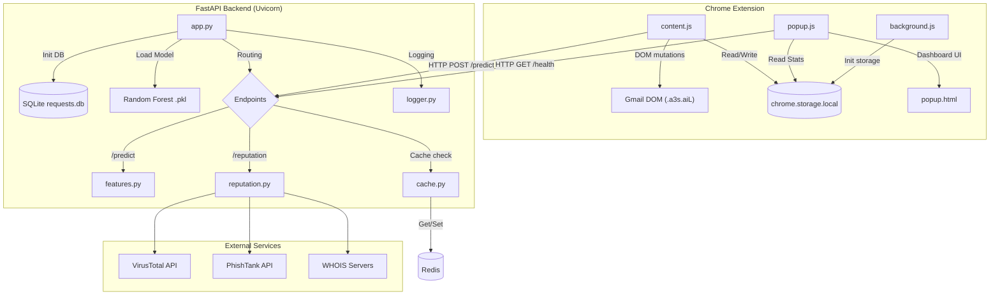
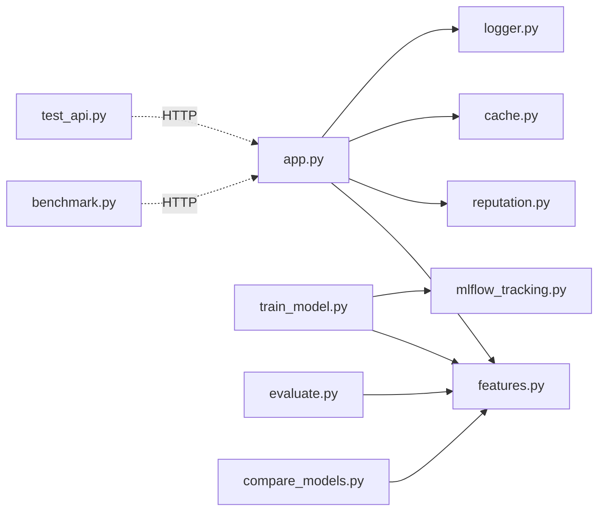
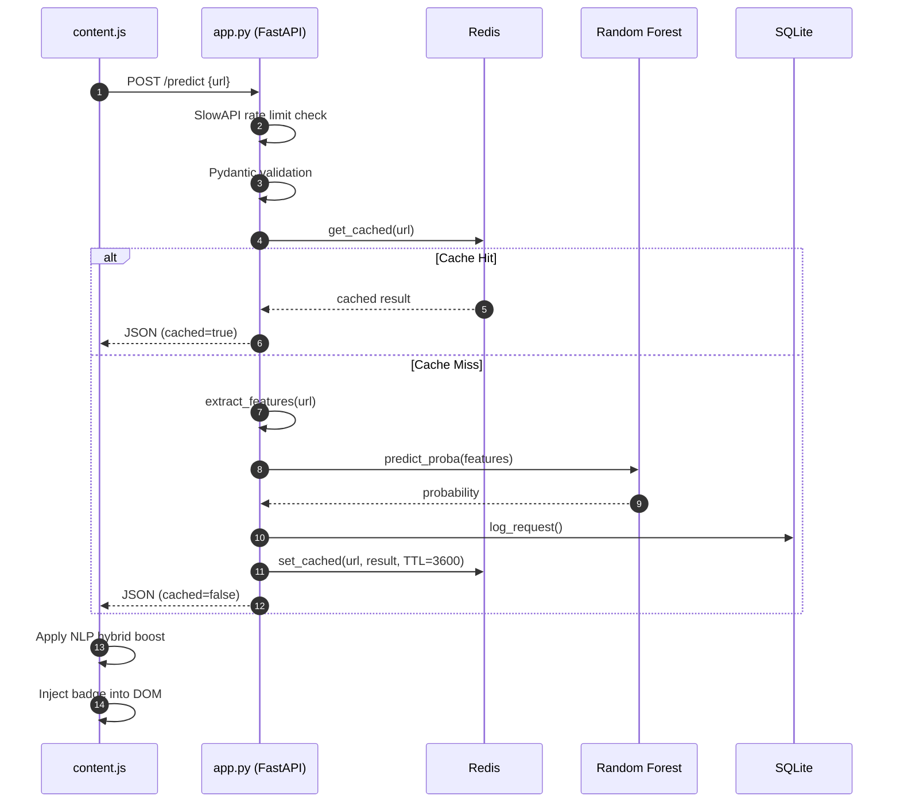

# Component Relationships

---

## System Architecture Diagram

---

## Backend Internal Dependency Graph

---

## Data Flow: Predict Request

---

## Key Interfaces

| Producer | Consumer | Mechanism |
| :--- | :--- | :--- |
| `content.js` | `app.py` | HTTP POST to `127.0.0.1:5000/predict` |
| `popup.js` | `app.py` | HTTP GET to `127.0.0.1:5000/health` |
| `app.py` | `features.py` | Direct Python function call |
| `app.py` | `cache.py` | Direct Python function call |
| `app.py` | `reputation.py` | Direct Python function call |
| `app.py` | `logger.py` | Direct Python `logger.info/error` |
| `app.py` | SQLite | `sqlite3.connect()` per request |
| `cache.py` | Redis | `redis.Redis()` persistent connection |
| `reputation.py` | VirusTotal | HTTP GET/POST via `requests` library |
| `reputation.py` | PhishTank | HTTP POST via `requests` library |
| `reputation.py` | WHOIS | TCP via `python-whois` library |
