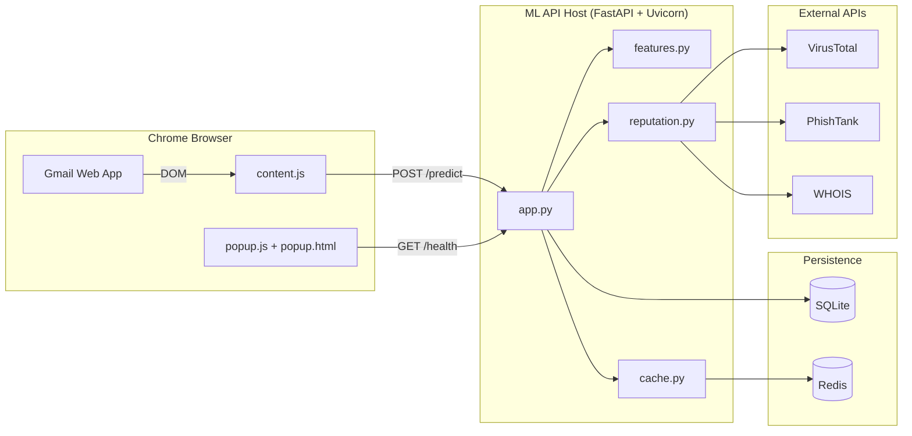
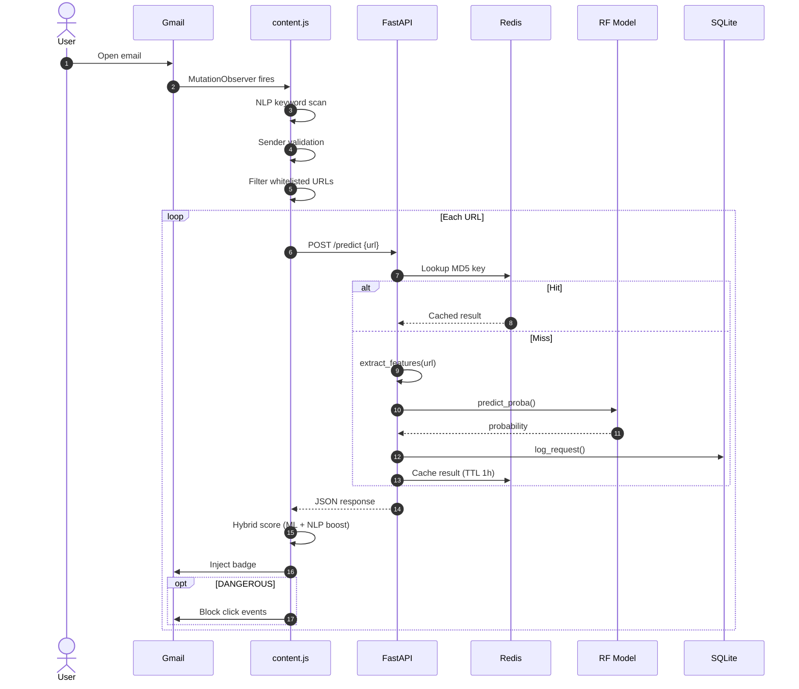
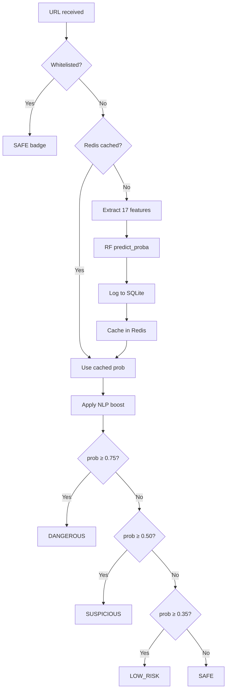
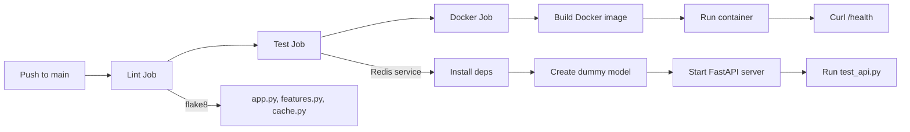

# Architecture Diagrams

---

## 1. System Architecture

```mermaid
graph LR
    subgraph Client ["Chrome Browser"]
        A[Gmail Web App]
        B[content.js]
        C[popup.js + popup.html]
    end

    subgraph Service ["ML API Host (FastAPI + Uvicorn)"]
        E[app.py]
        F[features.py]
        G[reputation.py]
        H[cache.py]
    end

    subgraph Storage ["Persistence"]
        I[(SQLite)]
        J[(Redis)]
    end

    subgraph Intel ["External APIs"]
        K[VirusTotal]
        L[PhishTank]
        M[WHOIS]
    end

    A -- DOM --> B
    B -- POST /predict --> E
    C -- GET /health --> E
    E --> F
    E --> G
    E --> H
    H --> J
    E --> I
    G --> K
    G --> L
    G --> M
```

---

## 2. URL Scanning Sequence Diagram

```mermaid
sequenceDiagram
    autonumber
    actor User
    participant Gmail
    participant Ext as content.js
    participant API as FastAPI
    participant Cache as Redis
    participant ML as RF Model
    participant DB as SQLite

    User->>Gmail: Open email
    Gmail->>Ext: MutationObserver fires
    Ext->>Ext: NLP keyword scan
    Ext->>Ext: Sender validation
    Ext->>Ext: Filter whitelisted URLs
    
    loop Each URL
        Ext->>API: POST /predict {url}
        API->>Cache: Lookup MD5 key
        alt Hit
            Cache-->>API: Cached result
        else Miss
            API->>API: extract_features(url)
            API->>ML: predict_proba()
            ML-->>API: probability
            API->>DB: log_request()
            API->>Cache: Cache result (TTL 1h)
        end
        API-->>Ext: JSON response
        Ext->>Ext: Hybrid score (ML + NLP boost)
        Ext->>Gmail: Inject badge
        opt DANGEROUS
            Ext->>Gmail: Block click events
        end
    end
```

---

## 3. Classification Decision Flowchart

```mermaid
flowchart TD
    A[URL received] --> B{Whitelisted?}
    B -- Yes --> C[SAFE badge]
    B -- No --> D{Redis cached?}
    D -- Yes --> E[Use cached prob]
    D -- No --> F[Extract 17 features]
    F --> G[RF predict_proba]
    G --> H[Log to SQLite]
    H --> I[Cache in Redis]
    I --> E
    E --> J[Apply NLP boost]
    J --> K{prob ≥ 0.75?}
    K -- Yes --> L[DANGEROUS]
    K -- No --> M{prob ≥ 0.50?}
    M -- Yes --> N[SUSPICIOUS]
    M -- No --> O{prob ≥ 0.35?}
    O -- Yes --> P[LOW_RISK]
    O -- No --> Q[SAFE]
```

---

## 4. CI/CD Pipeline

```mermaid
flowchart LR
    A[Push to main] --> B[Lint Job]
    B --> C[Test Job]
    C --> D[Docker Job]
    
    B -- flake8 --> B1[app.py, features.py, cache.py]
    C -- Redis service --> C1[Install deps]
    C1 --> C2[Create dummy model]
    C2 --> C3[Start FastAPI server]
    C3 --> C4[Run test_api.py]
    D --> D1[Build Docker image]
    D1 --> D2[Run container]
    D2 --> D3[Curl /health]
```
